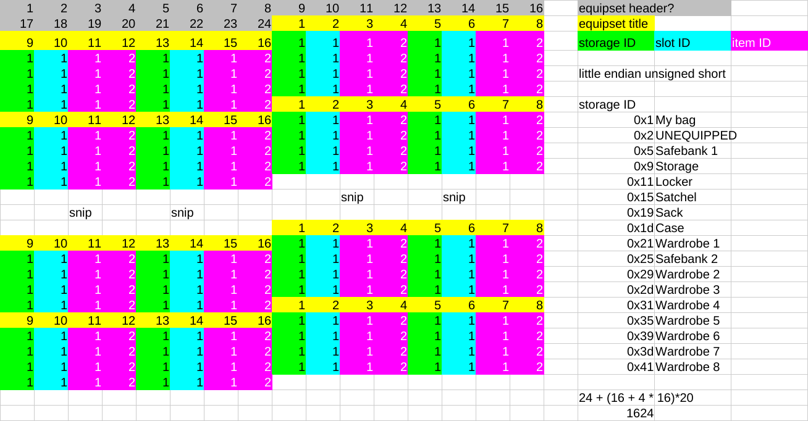

# print\_equipset

[https://hamham-fenrir.github.io/macroweb/](https://hamham-fenrir.github.io/macroweb/)のための装備セットをYAML化するスクリプト

## ファイルフォーマット

esX.dat ファイルが装備セット用のファイルです。

* 先頭24バイト(ヘッダ?)
* 以下、装備セット20個分
    * 16バイト: 装備セットのタイトル
    * 以下、16部位分
        * 1バイト: ストレージID(後述)
        * 1バイト: スロットID(後述)
        * 2バイト: アイテムID (little endian unsigned short)

24 + (16 + 4 * 16) * 20 = 1624 バイト

### ストレージID

* 0x1 : マイバッグ
* 0x2 : （装備を外す）
* 0x5 : モグ金庫1
* 0x9 : 収納家具
* 0x11 : モグロッカー
* 0x15 : モグサッチェル
* 0x19 : モグサック
* 0x1d : モグケース
* 0x21 : モグワードローブ1
* 0x25 : モグ金庫2
* 0x29 : モグワードローブ2
* 0x2d : モグワードローブ3
* 0x31 : モグワードローブ4
* 0x35 : モグワードローブ5
* 0x39 : モグワードローブ6
* 0x3d : モグワードローブ7
* 0x41 : モグワードローブ8

### スロットID

スロットIDとは、装備部位を示す装備スロットとは別のもので、各ストレージ内でどの並びにあるかを示す通し番号の仮の呼び名です。

装備セットにはストレージIDとスロットIDが含まれているため、同一ストレージ内に同名のアイテムがあっても区別して装備できるようです。一方、マクロにはストレージ番号（≒ID）しか記載できないため、同一ストレージ内の同名アイテムがあっても区別ができません。

なお、装備セット用ファイルにオーグメントの情報は含まれていません。

## 補記

ほとんど[ChatGPT](https://chatgpt.com/)で作成しました。
